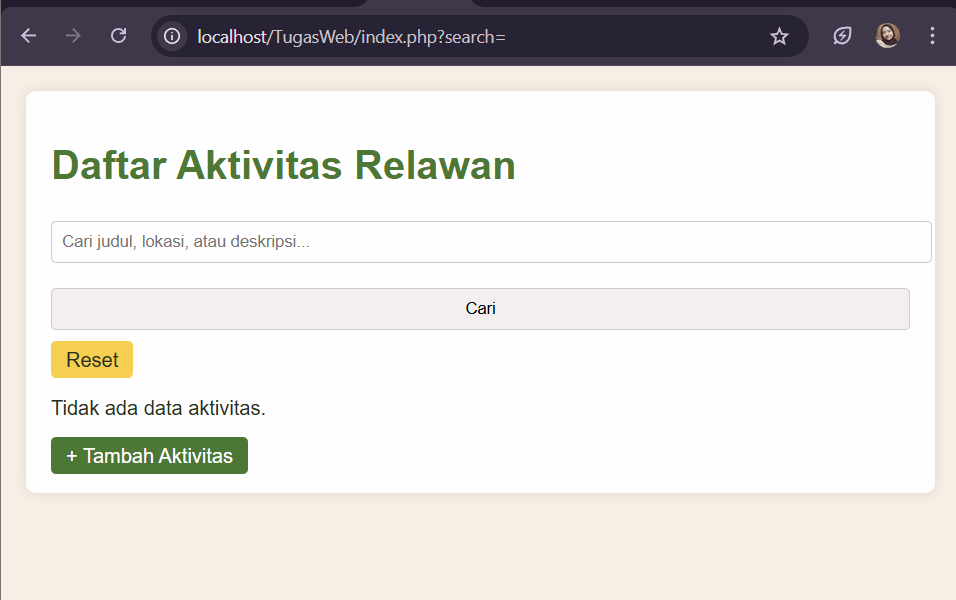
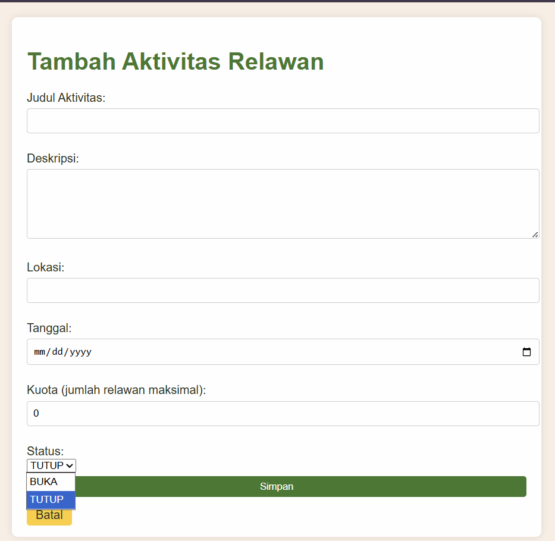
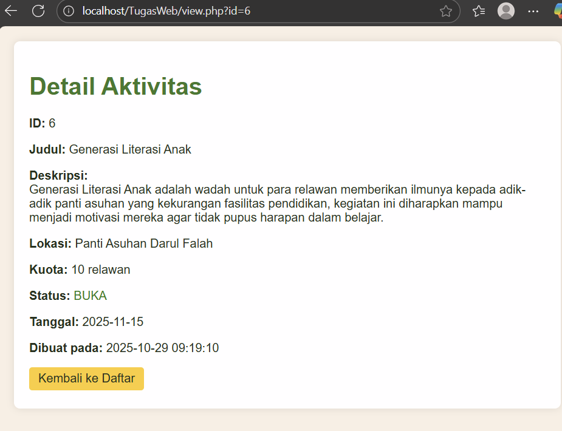
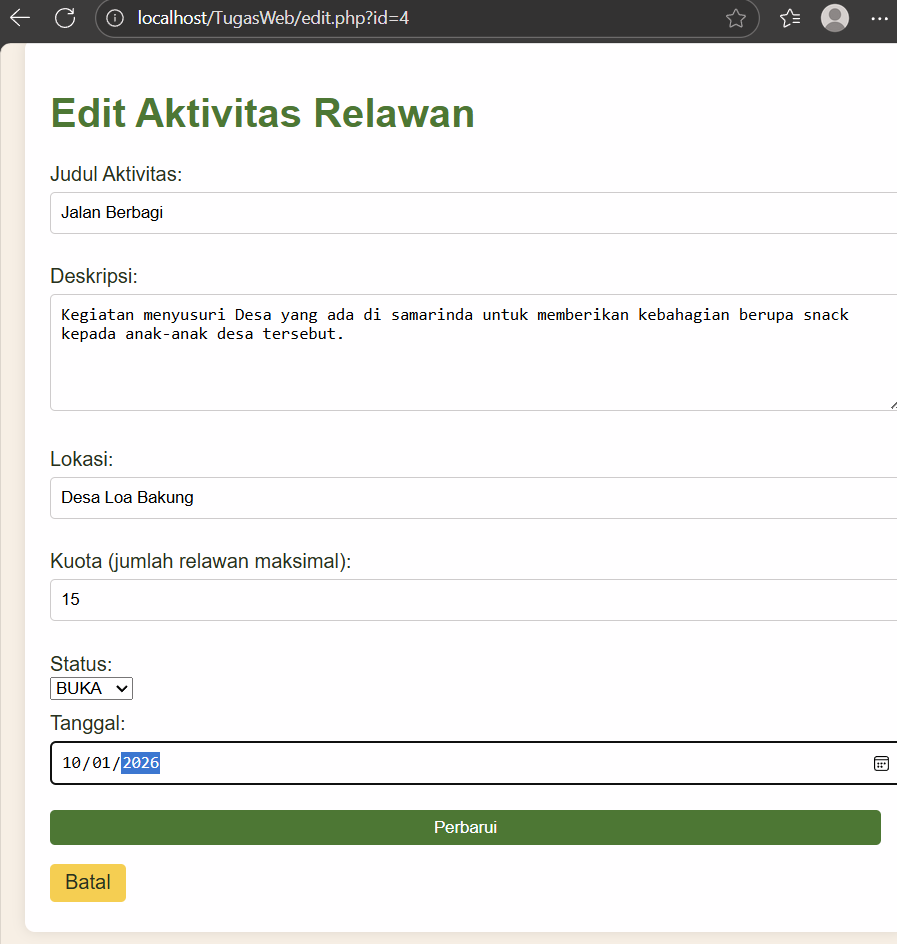
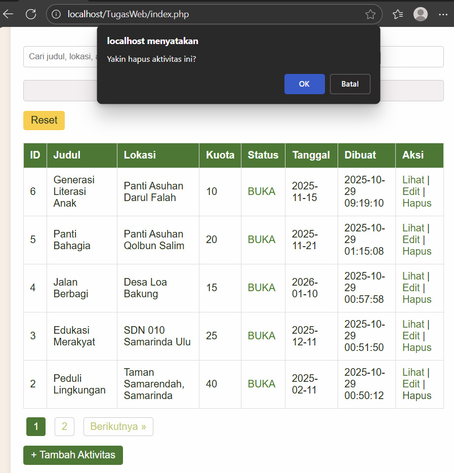

# Manajemen Aktivitas Relawan
Aplikasi web sederhana untuk mengelola data kegiatan relawan menggunakan PHP native dan MySQL.

## Fitur
- Tambah, lihat, edit, dan hapus aktivitas relawan (CRUD)
- Pencarian berdasarkan judul, lokasi, atau deskripsi
- Pagination (5 data per halaman)
- Validasi input dan sanitasi output
- Keamanan: Prepared Statement, XSS prevention
- Tampilan tabel data dengan urutan terbaru (`created_at DESC`)

## Kebutuhan Sistem
- PHP 8.0 atau lebih tinggi
- MySQL 5.7+
- Web server Laragon
- Browser modern (Chrome, Edge, Firefox, dll.)

## Instalasi

1. Buat database `volunteer_db` di MySQL.
2. Jalankan skrip SQL berikut:
   ```sql
   CREATE DATABASE volunteer_db;
   USE volunteer_db;
   CREATE TABLE activities (
       id INT AUTO_INCREMENT PRIMARY KEY,
       judul VARCHAR(255) NOT NULL,
       deskripsi TEXT NOT NULL,
       lokasi VARCHAR(255) NOT NULL,
       tanggal DATE NOT NULL,
       kuota INT NOT NULL,
       status ENUM ('BUKA', 'TUTUP') NOT NULL DEFAULT 'BUKA',
       created_at DATETIME DEFAULT CURRENT_TIMESTAMP
       
   );


3. Konfigurasi koneksi databse
Pastikan file config/database.php disesuaikan dengan pengaturan lokal:

    ```php
    $host = 'localhost';
    $dbname = 'volunteer_db';
    $username = 'root';
    $password = '';
    ```

4. Jalankan Aplikasi
- Start Apache dan MySQL
- Buka browser dan akses
http://localhost/ManajemenAktivitas/index.php

## Struktur Folder

```/Manajemen Aktivitas
├── assets/
│ ├── detailAktivitas.png
│ ├── editAktivitas.png
│ ├── hapusAktivitas.png
│ ├── tambahAktivitas.png
│ └── tampilanAwal.png
├── config/
│ └── database.php
├── css/
│ └── style.css
├── js/
│ └── script.js
├── create.php
├── delete.php
├── edit.php
├── index.php
├── README.md
└── view.php```


## Environment Config
DB_HOST=127.0.0.1
DB_NAME=volunteer_db
DB_USER=root
DB_PASS=

## Screenshoot










